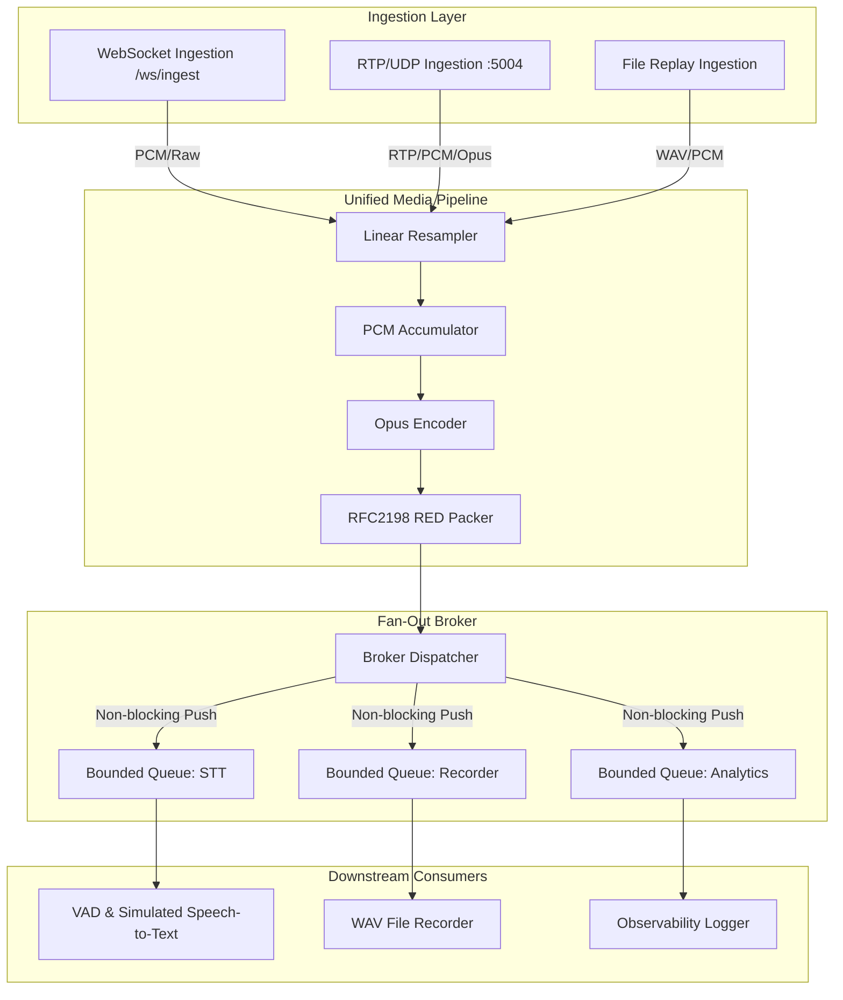

# Voice Ingestion Worker

This is a real-time media ingestion engine written in Go. It ingests audio from multiple sources (WebSocket browser mic, UDP/RTP packets, and simulated file loops), resamples and normalizes everything to 48kHz PCM, compresses it to Opus, packages it into RFC 2198 RED (redundant encoding) payloads, and broadcasts it to multiple isolated, concurrent consumers.

---

## Architecture Overview



### How It Works

*   **Ingestion**: WebSockets (`/ws/ingest`) for browser microphone data, UDP/RTP (`:5004`) for network audio streams, and a WAV-file loop for testing. The RTP receiver integrates a sequence buffer to handle out-of-order delivery and RED payload recovery.
*   **Pipeline**: Normalizes all incoming inputs to 48kHz mono 16-bit PCM. It processes audio in 20ms slices (960 samples), encodes them with Opus, and wraps them in RFC 2198 redundant packets (holding the current frame + the previous two frames for recovery).
*   **Broker & Isolation**: Distributes media packets to consumers (VAD transcripts, WAV recorder, metrics loggers). Each consumer gets a thread-safe, non-blocking queue. If a consumer hangs or slows down, it drops the oldest packets to keep latency low, completely isolating it from healthy consumers. Consumer panics are intercepted cleanly without stopping the daemon.

---

## Build Instructions

All build, test, and simulation tasks are containerized so you don't need compilation tools or dynamic audio libraries installed on your host.

### 1. Build the Docker Image
```bash
docker build -t voice-ingestion:latest .
```

### 2. Run Tests
Runs unit and integration tests with the Go race detector enabled inside the builder container:
```bash
docker build --target builder -t voice-ingestion-builder:latest .
docker run --rm voice-ingestion-builder:latest go test -v -race ./...
```

---

## Running the Server

### 1. Start the Worker Container
Mounts a local directory `recordings` to save files and starts the server:
```bash
mkdir -p recordings
docker run --rm -d \
  --name voice-ingestion-worker \
  -p 8080:8080 \
  -p 5004:5004/udp \
  -v $(pwd)/recordings:/app/recordings \
  voice-ingestion:latest
```

### 2. Open the Dashboard
Point your browser to **[http://localhost:8080](http://localhost:8080)**.
*   **Mic Stream**: Click "Browser Mic" to stream your mic to the server. The dashboard shows real-time waveforms and segment transcripts calculated from voice energy levels (VAD).
*   **File Replay**: Click "Start File Replay" to stream a loop on the server.

---

## Experiments

### Packet Loss Simulation (RFC 2198 RED)

We stream a 15-second WAV file to port 5004 while injecting a 20% random drop rate at the client to test packet recovery:

#### Scenario A: RED Disabled
```bash
docker exec voice-ingestion-worker /app/sender --host 127.0.0.1 --port 5004 --file testdata/input.wav --loss 20 --red=false
```
*   **Result**: The server reports high packet loss. The recorded file is truncated (~908KB instead of 1.42MB) and sounds choppy with audible silent gaps.

#### Scenario B: RED Enabled
```bash
docker exec voice-ingestion-worker /app/sender --host 127.0.0.1 --port 5004 --file testdata/input.wav --loss 20 --red=true
```
*   **Result**: The server receives the same loss rate but recovers over 97% of missing frames from the redundant payloads. The recorded file is full duration (~1.42MB) and plays back smoothly.

### Consumer Isolation

1.  **Slow Consumer**: Click "Simulate Slow" on the dashboard. A consumer lagging by 100ms is added. The dashboard will show the slow consumer dropping packets, but the browser microphone and recorder continue to run with zero lag.
2.  **Crash Recovery**: Click "Simulate Crash". A consumer that panics after 5 packets is added. The logs capture the panic recovery, and the daemon continues running.

---

## Performance & Scaling Metrics

These measurements were captured on an M4 Mac (10 CPU cores, 16GB RAM) running inside Docker.

### 1. Latency Distribution
Measures the duration from network adapter arrival, resampling, Opus encoding, RED packaging, fan-out, and consumer queue retrieval:
*   **P50 (Median)**: `2.73 ms`
*   **P95**: `2.76 ms`
*   **P99**: `2.79 ms`

### 2. Resource Usage
*   **Idle**: `0.1% CPU` | `14 MB RAM`
*   **Single Stream**: `1.2% CPU` | `18 MB RAM` (processes 48kHz audio, VAD, Opus encoding, and writing to WAV).
*   **Incremental Cost per Consumer**:
    *   Metrics/Loggers: `< 0.05% CPU`
    *   Opus Decoders/WAV Writers: `~0.4% CPU`

### 3. Scaling Limit
*   **Tested Ceiling**: **100 concurrent consumers** on a single stream.
*   **Resources at Ceiling**: `4.8% CPU` | `24 MB RAM`
*   **Why 100?**: Typically, a call stream is fanned out to 3-5 consumers (recorder, transcriber, loggers). Scaling to 100 demonstrates that our Go-channel-based bounded queue dispatcher handles high fan-out with negligible overhead and zero drops for healthy consumers.
